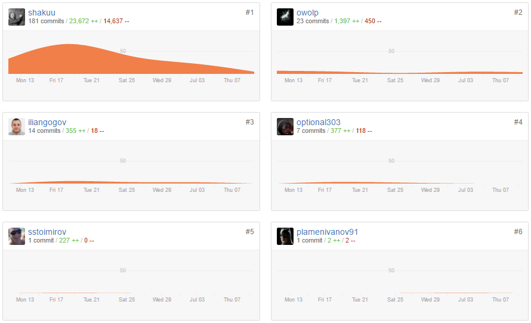

<!-- section start -->
<!-- attr: { class:'slide-title', showInPresentation:true, hasScriptWrapper:true } -->
# Team Captain Marvel

<!--  -->

	
C# OOP TeamWork

	
Telerik Academy by Progress

	<a href="https://github.com/Team-Captain-Marvel-2016" class="signature-link">Link to the GitHub repository</a>

<!-- section start -->
<!-- attr: { showInPresentation:true, style:'font-size: 0.7em' } -->

# Captain Marvel Members

| Name | TALS | GitHub |
| :------------- | :------------------- | :------------------------------------------|
| Златин Костов  | owolp       | [owolp](https://github.com/owolp)                   |
| Иван Китанов   | optional303 | [optional303](https://github.com/optional303)       |
| Илиян Гогов    | Iliangogov  | [iliangogov](https://github.com/iliangogov)         |
| Спас Стоимиров | sstoimirov  | [sstoimirov](https://github.com/sstoimirov)         |
| Христо Тодоров | todorovh    | [shakuu](https://github.com/shakuu)                 |
| ~~Михаил Маламов~~ | mmalamov    | [malamov](https://github.com/malamov)               |
| ~~Пламен Иванов~~  | pivanov     | [plamenivanov91](https://github.com/plamenivanov91) |

<!-- section start -->
<!-- attr: { class:'slide-title', showInPresentation:true, hasScriptWrapper:true } -->

# GitHub graphics

<!--  -->