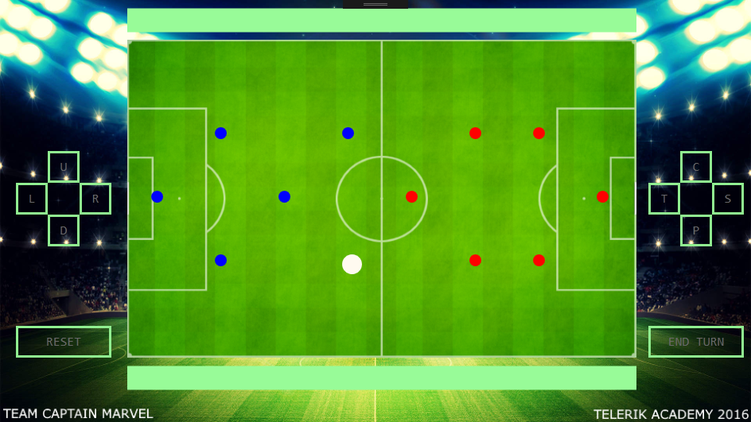

##### [Slides](https://rawgit.com/Team-Captain-Marvel-2016/TeamWorkSkeletonSample/master/Presentation/index.html)

# Demo

<iframe width="420" height="315" src="http://www.youtube.com/embed/GkRQT3_Ub8I" frameborder="0" allowfullscreen></iframe>

<!-- section start -->
<!-- attr: { class:'slide-title', showInPresentation:true, hasScriptWrapper:true } -->
# Team Captain Marvel

<!--  -->

	
C# OOP TeamWork

	
Telerik Academy by Progress

	<a href="https://github.com/Team-Captain-Marvel-2016" class="signature-link">Link to the GitHub repository</a>

<!-- section start -->
<!-- attr: { showInPresentation:true, style:'font-size: 0.7em' } -->

# Captain Marvel Members

| Name | TALS | GitHub |
| :------------- | :------------------- | :------------------------------------------|
| Златин Костов  | owolp       | [owolp](https://github.com/owolp)                   |
| Иван Китанов   | optional303 | [optional303](https://github.com/optional303)       |
| Илиян Гогов    | Iliangogov  | [iliangogov](https://github.com/iliangogov)         |
| Спас Стоимиров | sstoimirov  | [sstoimirov](https://github.com/sstoimirov)         |
| Христо Тодоров | todorovh    | [shakuu](https://github.com/shakuu)                 |
| ~~Михаил Маламов~~ | mmalamov    | [malamov](https://github.com/malamov)               |
| ~~Пламен Иванов~~  | pivanov     | [plamenivanov91](https://github.com/plamenivanov91) |

<!-- section start -->
<!-- attr: { class:'slide-title', showInPresentation:true, hasScriptWrapper:true } -->

# GitHub graphics

<!--  -->

<!-- section start -->
<!-- attr: { class:'slide-title', showInPresentation:true, hasScriptWrapper:true } -->

# Football Player Class Diagram

<!--  -->

<!-- section start -->
<!-- attr: { class:'slide-title', showInPresentation:true, hasScriptWrapper:true } -->

# Player Class Diagram

<!--  -->

# Shoot implementation

- When shoot button "S" is clicked:
  - There are several checks,based on attack stats of shooter and save stats of the enemy goalkeeper plus a coeficient of a chance token from random generator called "Dice"
- If shooter's stats is dominating we count it as a goal and set the players in initial positions on the field.
- If goalkeeper stats is dominatng we count it as a save.And player wth the ball now is enemy goalkeeper.

<!-- section start -->
<!-- attr: { showInPresentation:true, style:'font-size: 0.7em', hasScriptWrapper:true } -->

# Shoot Implementation Screenshot

<!--  -->

<!-- section start -->
<!-- attr: { showInPresentation:true, style:'font-size: 0.7em' } -->

# Pass implementation

- When pass button "P" is clicked:
  - There are several checks,based on pass stats of player with the ball and interception stats of the enemy player on the way of a pass
- If passing player stats is dominating we count it as a successfull pass and the ball is still in the same team posession.
- If interceppiant player stats is dominatng we count it as a interception.And player wth the ball now is enemy player.

<!-- section start -->
<!-- attr: { showInPresentation:true, style:'font-size: 0.7em', hasScriptWrapper:true } -->

# Pass Implementation Screenshot

<!--  -->

<!-- section start -->
<!-- attr: { showInPresentation:true, style:'font-size: 0.7em' } -->

# IDrawOnCanvas - Drawing on Canvas

4 Properties:

- FieldPosition: Position within the Canvas in pixels
- GridPosition: Position on the PlayingField Grid ( matrix cell )
- VisualToken: Shape to draw
- CanvasChildIndex: the index in Canvas.Children[], for ease of identifying event senders

2 Methods:

- SetVisualTokenColor(SolidColorBrush): Each player object is responsible for setting the color of the playersin their team
- SetVisualTokenSize: Mark their active player

<!-- section start -->
<!-- attr: { showInPresentation:true, style:'font-size: 0.7em', hasScriptWrapper:true } -->

# IDrawOnCanvas Screenshot

<!--  -->

<!-- section start -->
<!-- attr: { showInPresentation:true, style:'font-size: 0.7em' } -->

# ButtonGroup and ElementManager

ButtonGroup:

- Implements IElementGroup
- Manages individual Button controls

ElementManager

- Manages IElementGroups
- Access individual groups through IElementGroup.Name property

<!-- section start -->
<!-- attr: { showInPresentation:true, style:'font-size: 0.7em', hasScriptWrapper:true } -->

# ButtonGroup and ElementManager Screenshot

<!--  -->

<!-- section start -->
<!-- attr: { showInPresentation:true, style:'font-size: 0.7em' } -->

# Class ElementManager

Class ElementManager

- Methods for subscribing and unsubscribing to events: Show, Hide, Enable, Disable
- Raise events depending on current game state

<!-- section start -->
<!-- attr: { showInPresentation:true, style:'font-size: 0.7em', hasScriptWrapper:true } -->

# Class ElementManager Screenshot

<!--  -->

<!-- section start -->
<!-- attr: { showInPresentation:true, style:'font-size: 0.7em' } -->

# How To Play

How To Play

- Arrow Buttons ( Left side )
  - Move selected player
- [P]ass button
  - Click on a friendly player to pass to, active when current FootballPlayer has the ball
- [S]hoot button:
  - Shoot at the enemy goal, active when current FootballPlayer has the ball
- [C]all for pass
  - Ask for the ball, active when current team has ball possession.
- [T]ackle: attempt to take the ball off the enemy player, active when next to a FootballPlayer with the ball
- End Turn button: end current turn
- Rest button: start over

<!-- section start -->
<!-- attr: { showInPresentation:true, style:'font-size: 0.7em', hasScriptWrapper:true } -->

# How To Play Screenshot

<!--  -->

<!-- section start -->
<!-- attr: { showInPresentation:true, style:'font-size: 0.7em', hasScriptWrapper:true } -->

# Let's Play

<!--  -->